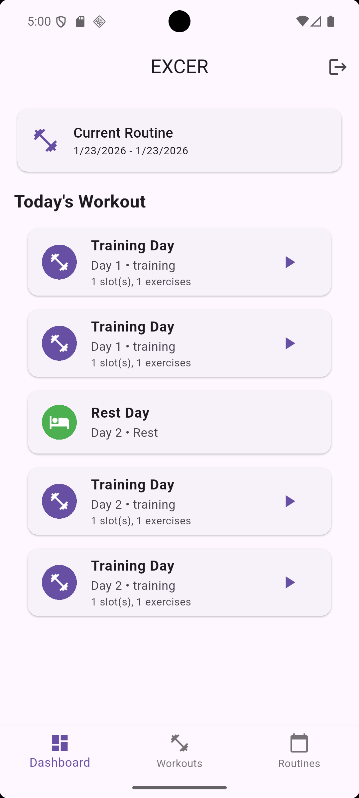
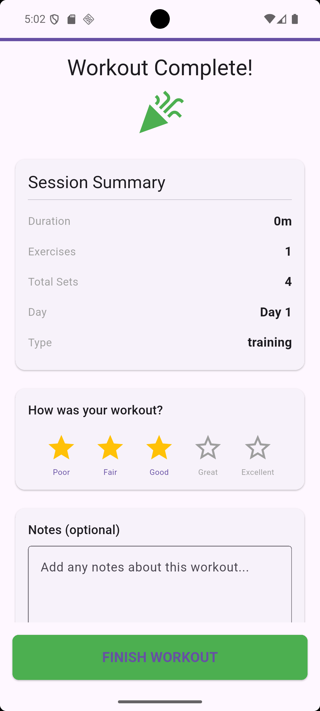

# excerfit

A Flutter project created while learning a awesome opensource mobile app : Wger Fitness App

Here is a `README.md` for your GitHub repository, written with the enthusiastic and helpful tone of a junior developer.

-----

# ExcerFit - Flutter Workout Tracker 🏋️‍♂️

Hey there\! This is my workout tracking app built with **Flutter** and **Provider**. I created this to help people keep track of their gym routines, whether it's a heavy lifting day or a much-needed rest day.

It uses a clean UI to show you exactly what exercises you need to do, how many sets/reps, and even has a "Gym Mode" to help you through the session\!

## 📸 Screenshots

| Workout Preview | Workout Summary |
| :---: | :---: |
|  |  |

*(Note: Make sure to update the image links above with your actual GitHub paths\!)*

-----

## 📱 App Screenshots

| Workout Preview | Exercise Details | Workout Summary |
| :---: | :---: | :---: |
|  |  |  |
| *Today's Plan* | *Detailed View* | *Session Complete* |

-----

## ✨ Features

  * **Dynamic Day Details:** Automatically switches between "Training Day" and "Rest Day" views.
  * **Exercise Slots:** Organizes exercises into slots with specific comments and instructions.
  * **State Management:** Uses the `Provider` pattern to fetch and manage workout data efficiently.
  * **Gym Mode:** A dedicated screen to follow along while you're actually at the gym.
  * **Workout Summary:** Get a nice recap of your sets and duration once you're finished.

## 🚀 How it Works (The Code)

The app's logic is centered around the `DayDetailScreen`. Here’s a quick look at what’s happening under the hood:

  * **Provider Integration:** We use `Provider.of<DaysProvider>(context)` to grab the workout data for the specific day passed through the navigation arguments.
  * **Conditional UI:** I used a lot of `if (day.isRest)` checks. If it's a rest day, the app shows a relaxing spa icon 🧘‍♂️; otherwise, it shows the exercise list and a "Start Workout" button.
  * **Navigation:** It uses named routes (`GymModeScreen.routeName`) to keep the navigation clean and easy to manage.

## 🛠️ Tech Stack

  * **Frontend:** Flutter & Dart
  * **State Management:** Provider
  * **Backend:** (Work in progress - Django integration coming soon\!)

## 🏁 Getting Started

1.  Clone this repo: `git clone https://github.com/yourusername/your-repo-name.git`
2.  Get packages: `flutter pub get`
3.  Run the app: `flutter run`

-----